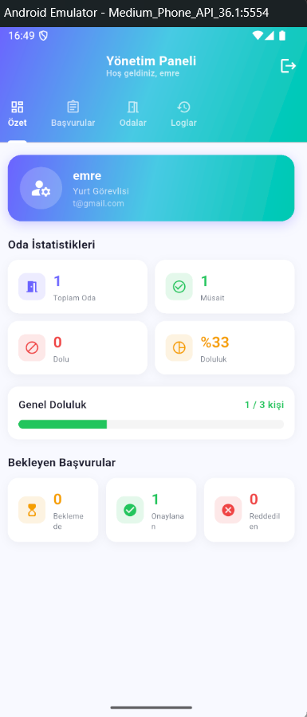
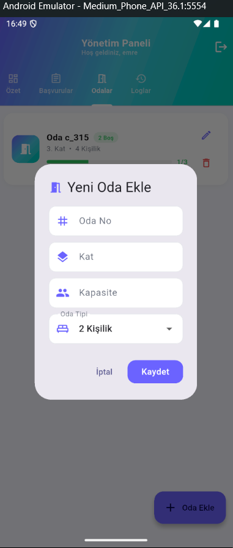
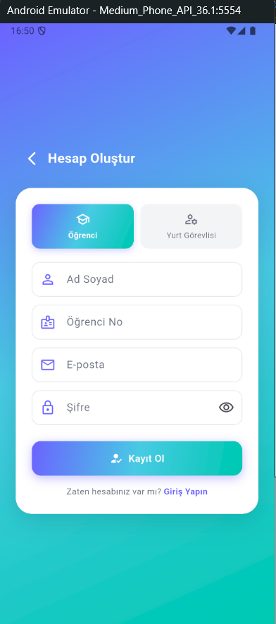
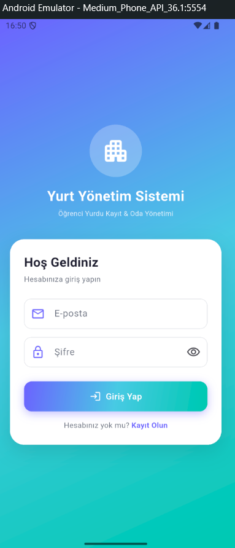

# Yurt Yönetim Sistemi

**Öğrenci Yurdu Kayıt ve Oda Kapasite Yönetimi**

- **Öğrenci:** Enes Işık
- **Öğrenci No:** 243301004
- **Ders:** Mobil Programlama Final Projesi 2026

---

## Test Hesapları

| Rol | E-posta | Şifre |
|-----|---------|-------|
| Yurt Görevlisi (Admin) | admin@yurt.com | admin123 |
| Öğrenci | ogrenci@yurt.com | ogrenci123 |

---

## Uygulama Özeti

Öğrenci yurdu kayıt ve oda kapasite takip uygulaması. Öğrenciler odaları görüntüleyip başvuru yapabilir, yurt görevlisi başvuruları onaylayıp reddedebilir.

---

## Ekranlar

1. **Giriş / Kayıt** — Firebase Auth ile kimlik doğrulama
2. **Odalar Listesi** — Tüm odalar, doluluk durumu ve renk göstergesi
3. **Oda Detayı** — Kapasite, boş yer, başvuru butonu
4. **Başvuru Formu** — Odaya başvuru gönderme
5. **Profil** — Başvuru geçmişi ve durum takibi
6. **Admin Paneli** — Başvuru onay/red, oda ekleme/silme, log görüntüleme

---

## Kullanılan Paketler

| Paket | Sürüm | Kullanım |
|-------|-------|---------|
| firebase_core | ^3.13.0 | Firebase başlatma |
| firebase_auth | ^5.5.2 | Kimlik doğrulama |
| cloud_firestore | ^5.6.6 | Veri tabanı |
| provider | ^6.1.2 | State management |
| go_router | ^14.8.1 | Navigasyon |
| intl | ^0.20.2 | Tarih formatlama |

---

## Özellikler

- Firebase Auth ile oturum yönetimi (uygulama kapanınca oturum korunur)
- Gerçek zamanlı Firestore stream'leri ile anlık oda doluluk takibi
- Admin: başvuru onaylama/reddetme, oda ekleme/silme, log görüntüleme
- Öğrenci: oda listeleme, detay, başvuru yapma, başvuru geçmişi
- Tüm işlemlerde otomatik log kaydı
- Aynı odaya mükerrer başvuru engeli

---

## Ekran Görüntüleri

---

## Firestore Koleksiyonları

- `users` — Kullanıcı profilleri (rol, öğrenci no, oda bilgisi)
- `rooms` — Odalar (numara, kat, kapasite, doluluk)
- `applications` — Başvurular (durum: pending/approved/rejected)
- `logs` — Tüm işlem kayıtları
